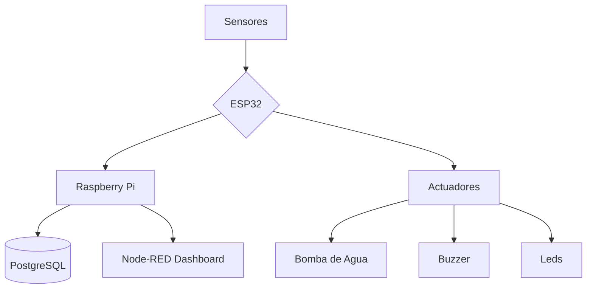

# 🚨 Sistema Anti-Inundaciones de Sótanos ⚡  
**Autores:** Uriel Yañez Aguayo y Jose Armando Ruano Mascorro  
*Proyecto final de la materia Aplicaciones de IoT*

  

---

## 🌟 Características Clave
- 🚿 Detección en tiempo real de niveles de agua
- 🌡️ Monitoreo ambiental (temperatura/humedad)
- 🚨 Sistema de alertas mediante email
- 💧 Activación automática de bomba de agua
- 📊 Registro histórico en base de datos

---

## 🛠️ Arquitectura del Sistema

# 📋 Especificaciones Técnicas Detalladas
## 🔌 Hardware
Componente	Especificaciones Técnicas	Ubicación en el Sistema
ESP32	WiFi 802.11 b/g/n, Bluetooth 4.2	Unidad central de control
Sensor de Agua	Voltaje: 3.3-5V, Salida digital	Nivel del piso
HC-SR04 (Ultrasónico)	Rango: 2-400cm, Precisión: 3mm	Techo del sótano
Bomba de Agua	12V DC, 5L/min, 3m de carga	Punto más bajo del sótano
Tira LED RGB	WS2812B, 30 LEDs/m	Zona de alerta visual

## 📊 Dashboard en Node-RED
Agregar captura de la interfaz

## ⚡ Diagrama de Conexiones
Agregar diagrama
