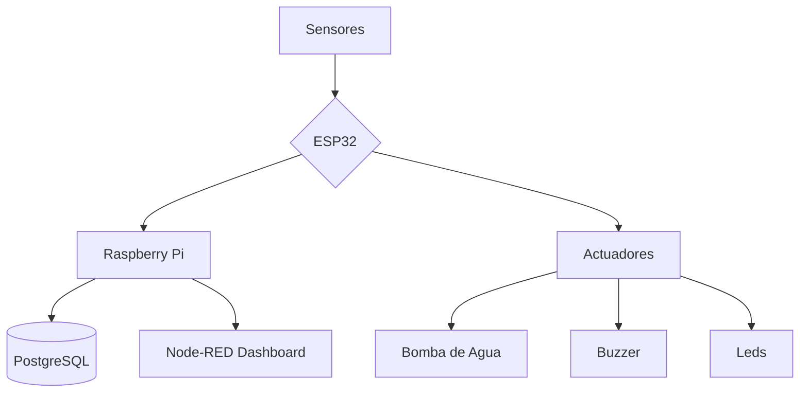

# 🚨 Sistema Anti-Inundaciones de Sótanos ⚡  
**Autores:** Uriel Yañez Aguayo y Jose Armando Ruano Mascorro  
*Proyecto final de la materia Aplicaciones de IoT*

---

## 🌟 Características Clave
- 🚿 Detección en tiempo real de niveles de agua
- 🌡️ Monitoreo ambiental (temperatura/humedad)
- 🚨 Sistema de alertas mediante email
- 💧 Activación automática de bomba de agua
- 📊 Registro histórico en base de datos

---

## 🛠️ Arquitectura del Sistema

---
# 📋 Especificaciones Técnicas Detalladas
## 🔌 Hardware
| Componente               | Especificaciones Técnicas               | Ubicación en el Sistema       |
|--------------------------|-----------------------------------------|--------------------------------|
| ESP32                    | WiFi 802.11 b/g/n, Bluetooth 4.2        | Unidad central de control      |
| Sensor de Agua           | Voltaje: 3.3V, Salida Analógica         | Nivel del piso                 |
| HC-SR04 (Ultrasónico)    | Rango: 2-400cm, Precisión: 3mm          | Techo del sótano               |
| Bomba de Agua            | 5V DC, 5L/min,                          | Punto más bajo del sótano      |
| Tira LED RGB WS2812B     | 10 LED's                                | Zona de alerta visual          |
| Buzzer                   | Voltaje: 5V, Frecuencia: 2-4kHz         | Zona de alerta auditiva        |
| Driver L298N             | Voltaje: 5V                             | Control de bomba de agua       |
| DHT11                    | Rango: 20-80% HR, 0-50°C, Salida digital| Área central del sóbano        |

## 📊 Dashboard en Node-RED

---

## ⚡ Diagrama de Conexiones

---

## 🔧 Desarrollo del Prototipo

---
## 🏆 Resultados Obtenidos
https://drive.google.com/file/d/13fid7XWJDTRM3HQdsh5ycpNJrDNyhR2i/view?usp=drivesdk
